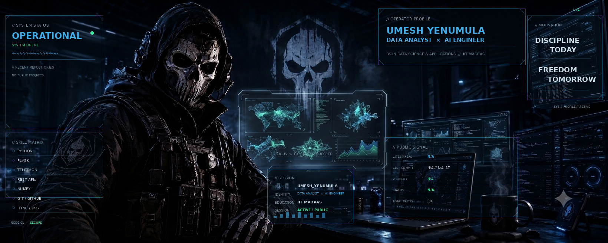

<div align="center">



<br>

<h2>UMESH YENUMULA</h2>

<p>
  <strong>DATA ANALYST</strong>
  &nbsp; × &nbsp;
  <strong>AI ENGINEER</strong>
</p>

<p>
  🎓 IIT MADRAS
  &nbsp; • &nbsp;
  BS IN DATA SCIENCE & APPLICATIONS
</p>

<p>
  
  
  
  
</p>

<p>
  <code>BUILD</code>
  &nbsp; <code>LEARN</code>
  &nbsp; <code>EXPERIMENT</code>
  &nbsp; <code>EVOLVE</code>
</p>

</div>

---

<div align="center">

### ⚡ CURRENT STATE

`DATA ANALYSIS` &nbsp; `AUTOMATION` &nbsp; `APIs` &nbsp; `BACKEND` &nbsp; `AI`

</div>

<br>

<table align="center">
<tr>
<td width="50%" valign="top">

### 🧠 TECH STACK

```text
Python              ███████████████░░░
Git / GitHub        ███████████████░░░
Flask               ███████████░░░░░░░
Telethon            ███████████░░░░░░░
REST APIs           ███████████░░░░░░░
NumPy               ██████████░░░░░░░░
HTML / CSS          ██████████░░░░░░░░
C / C++             ████████░░░░░░░░░░
SQL / DBMS          ██████░░░░░░░░░░░░
